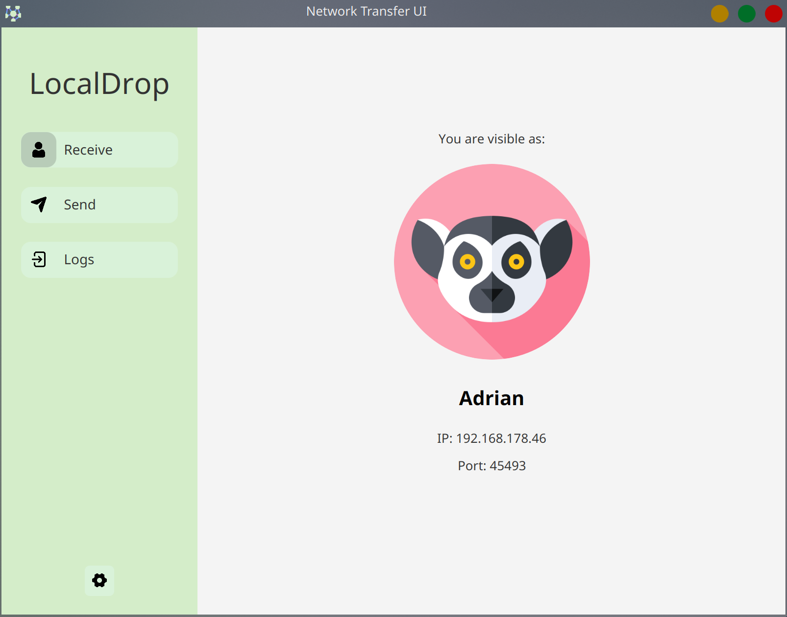

# Introduction to the problem
Sharing data between devices is commonly done via email attachments or messenger apps. However, these methods are limited in terms of the file size they support. For larger files, services like WeTransfer allow users to upload and share files (up to 2 GB) by generating a download link that others can access.
While convenient, this approach has several drawbacks. Firstly, uploading personal data to third-party servers means relinquishing control over where and how the data is stored. Secondly for some usecases, even 2GB is not sufficient. Thirdly, transferring data to distant servers often introduces bandwidth bottlenecks, significantly reducing transmission speeds. This issue isn’t unique to WeTransfer — it also affects email and messaging apps. 
In contrast, Local Area Networks (LANs) typically offer much higher speeds, often up to 1 Gbit/s, whereas typical internet speeds — like those measured via speedtest.net — may be limited to 70 Mbit/s or less, depending on the connection.
To address these issues, the application LocalDrop was developed. It enables users to send files directly between devices on the same LAN, without relying on external servers. Both the sender and receiver must have the application installed. A built-in peer discovery service automatically identifies other LocalDrop users on the network. Once connected, users can transfer any files via TCP, leveraging full LAN speeds and avoiding third-party data handling altogether.

# Setup
Either import the project as Gradle Project in the IDE of your choice or run directly from the command line:
```bash
gradle build
```
```bash
gradle run
```
The application itself can be configured in its settings page. It was tested on Fedora and Windows.

# Code structure
The project’s code is structured in the following way:
- The org.deg.core packge contains the logic for sending and receiving files. Most importantly it contains the classes Peer, FileSender and FileReceiver
- The org.deg.discovery package contains the implementations of the Hello-Bye and the Discovery-Protocol.
- The org.deg.backend package contains the backend facade as well as user configurations for the application.
- The org.deg.ui package contains the javafx-GUI.
- The org.deg.utils package contains various utility methods used all around the place.

I added javadocs to methods and classes (except for the GUI), so generally the code should be well documented.

# Protocol Description
The LocalDrop application fulfills the following core functional requirements:
- **Peer Discovery**: Users should be able to discover other users within the same local network.
- **File and Folder Transfer**: Users should be able to send files and folders to each other via LAN.

## Peer Discovery via Custom UDP Protocols
To satisfy the first requirement, two custom protocols were developed on top of UDP:
- Hello-Bye Protocol
- Discovery Protocol
### Hello-Bye Protocol
This protocol handles dynamic peer visibility within the LAN. When a user launches or exits the application, a UDP broadcast is sent to inform all other peers about this change. On startup, a peer broadcasts the following information:
- HELLO header
- Peer name
- Peer IP address
- TCP port for incoming file transfers 
 
On shutdown, the same information is broadcast using a BYE header. Peers continuously listen for these broadcasts and update their local list of active peers accordingly.
###  Discovery Protocol
While the Hello-Bye protocol handles real-time join/leave updates, a newly started peer still needs a way to discover currently active peers. This is where the Discovery Protocol comes into play. The new peer broadcasts a DISCOVERY_REQUEST message. All listening peers respond individually with a DISCOVERY_RESPONSE, containing:
- Response header (DISCOVERY_RESPONSE)
- Responding peer's name, IP, and TCP port

The new peer listens for a predefined time window to collect all responses and populate its list of known peers.

## File and Folder Transmission via TCP
To support file transfer between peers, each peer listens for incoming TCP connections on the port advertised through the Hello-Bye and Discovery protocols. A simple handshake mechanism is used to initiate transfers in a user-friendly and robust way:
**Metadata Exchange:** The sender initiates the transfer by sending a metadata object, which includes:
- Number of files
- Name and size (in bytes) of each file
- Sender’s name, IP, and TCP port

**Response Handling:** The receiver inspects the metadata and sends back one of two responses:
- ACCEPT — initiates the file transmission
- DENY — cancels the transmission
   
**File Transfer:** If accepted, the sender streams the file data as a byte sequence in the order defined in the metadata. Throughout this process, transfer progress is tracked for user feedback.